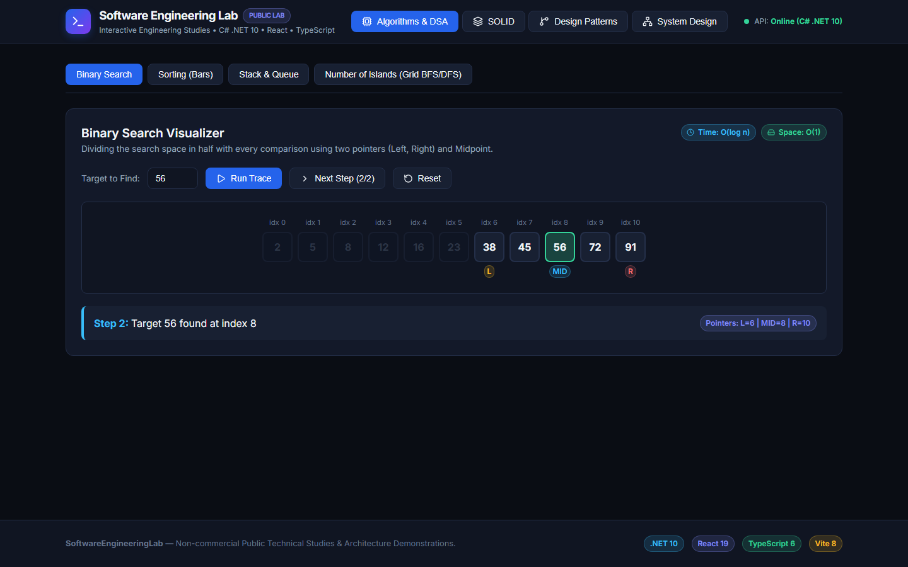
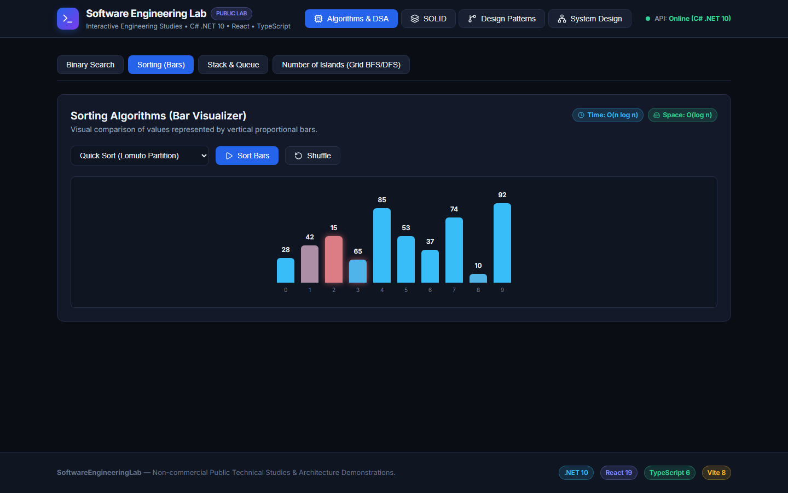
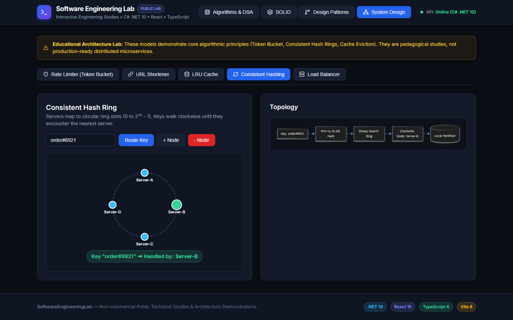
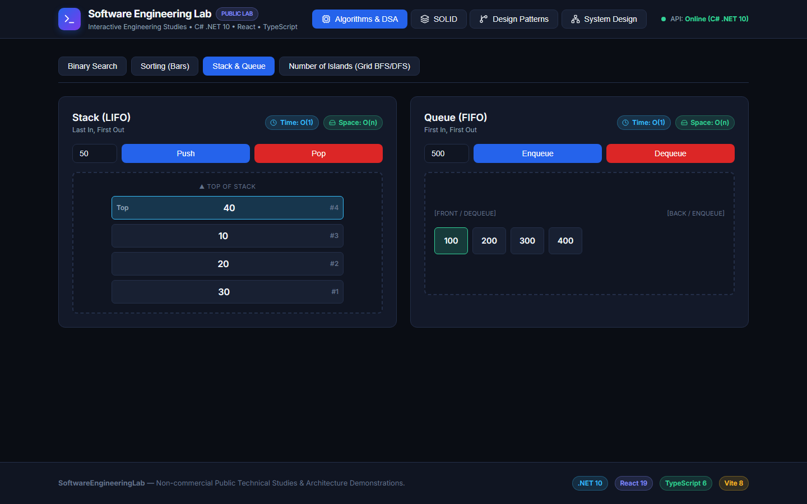
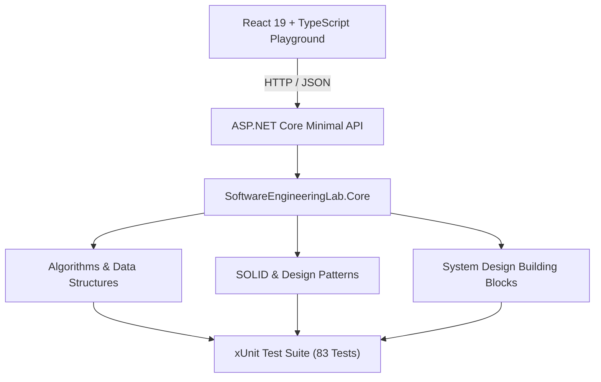

# Software Engineering Lab

> An interactive software engineering playground built with .NET, React and TypeScript to explore algorithms, design patterns, SOLID principles and system design concepts.

[](https://dotnet.microsoft.com/)
[](https://react.dev/)
[](https://www.typescriptlang.org/)
[](https://github.com/led-21/SoftwareEngineeringLab/actions/workflows/ci.yml)
[](backend/SoftwareEngineeringLab.Tests)
[](LICENSE)



## Overview

This repository is a hands-on engineering playground focused on implementing, testing, and visualizing core software engineering concepts. It brings together algorithmic fundamentals, object-oriented design principles, reusable design patterns, and system design building blocks in a modular C# / .NET 10 backend paired with a React and TypeScript interface.

Each module is structured as clean, isolated domain logic backed by automated xUnit tests and exposed through an ASP.NET Core Minimal API, enabling step-by-step execution tracing and real-time state inspection in the browser.

## Why This Project

- **Implementation beyond theory** — translates classic algorithms and architectural concepts into working, strongly typed C# and TypeScript code.
- **Interactive execution tracing** — connects backend execution steps to visual pointer states, caches, hash rings, and traffic simulators.
- **Explicit architectural trade-offs** — pairs SOLID principles and GoF patterns with side-by-side anti-pattern refactors, UML diagrams, and applicability guidelines.
- **Testable and isolated design** — keeps core implementations free of framework coupling and verified by unit tests.
- **Full-stack integration** — combines a .NET 10 Minimal API with a resilient React playground that supports both live API execution and client-side simulation.

## Engineering Areas

| Area | Modules & Topics | Reference |
| :--- | :--- | :--- |
| **Algorithms & Data Structures** | Arrays, Search, Sorting, Linked Lists, Trees, Graphs, Dynamic Programming, Strings, Stack / Queue | [docs/algorithms.md](docs/algorithms.md) |
| **SOLID Principles** | Single Responsibility (SRP), Open-Closed (OCP), Liskov Substitution (LSP), Interface Segregation (ISP), Dependency Inversion (DIP) | [docs/solid-principles.md](docs/solid-principles.md) |
| **Design Patterns** | **Creational** (Singleton, Factory Method, Builder), **Structural** (Adapter, Decorator, Facade), **Behavioral** (Observer, Strategy, Command) | [docs/design-patterns.md](docs/design-patterns.md) |
| **System Design** | Token Bucket Rate Limiter, Base62 URL Shortener, LRU Cache, Consistent Hashing, Round Robin Load Balancer, Async Chat Queue Broker | [docs/system-design.md](docs/system-design.md) |

## Application Preview

### Algorithm Visualization



Real-time sorting bar visualizer and step-by-step binary search pointer tracing with asymptotic time and space complexity indicators.

### System Design Playground



Interactive system design simulations featuring an SVG Consistent Hash Ring, Token Bucket rate limiting, LRU cache eviction, and Mermaid topology diagrams.

### Data Structures Playground



Interactive LIFO Stack and FIFO Queue visualizers with real-time push, pop, enqueue, and dequeue state updates.

## Architecture



- **`SoftwareEngineeringLab.Core`** contains pure C# implementations with zero web or infrastructure dependencies.
- **`SoftwareEngineeringLab.Api`** exposes interactive endpoints for algorithm execution, pattern catalogs, and system design simulations.
- **`frontend`** renders step-by-step visualizers, code comparisons, and Mermaid diagrams.
- **`SoftwareEngineeringLab.Tests`** validates algorithmic invariants, edge cases, and system design state transitions.
- **GitHub Actions CI** builds and verifies both backend and frontend pipelines on every push and pull request.

### Tech Stack

| Area | Technology |
| :--- | :--- |
| **Core / Backend** | C# / .NET 10 |
| **API** | ASP.NET Core Minimal API |
| **Frontend** | React 19 + TypeScript 6 |
| **Build** | Vite 8 |
| **Backend Tests** | xUnit |
| **CI** | GitHub Actions |

## Featured Implementations

- **Binary Search Visualizer** — Step-by-step search space partitioning with active `L`, `MID`, and `R` pointer tracing.
- **Sorting Visualizer** — Proportional bar comparisons and swaps covering QuickSort (Lomuto), MergeSort, and HeapSort.
- **Token Bucket Rate Limiter** — Sub-second fractional token refill with burst handling and HTTP 200 / 429 simulation.
- **Consistent Hashing** — FNV-1a 32-bit hash ring with virtual node replicas and $O(\log n)$ binary search clockwise routing.
- **LRU Cache** — Thread-safe $O(1)$ lookup and eviction combining a hash map with a doubly linked list.
- **Command Pattern with Undo** — Encapsulated document mutations with stack-based rollback history.
- **Graph Traversal** — Depth-first and breadth-first search, 2D grid island counting, and Kahn's topological sort.

## Engineering Details

- **Generic data structures**: Type-safe `CustomStack<T>`, `CustomQueue<T>`, and `LruCache<TKey, TValue>` implementations.
- **Algorithmic complexity awareness**: Implementations designed around explicit time and space bounds ($O(1)$ LRU operations, $O(\log n)$ ring lookup, $O(1)$-space DP optimizations).
- **Asynchronous coordination**: In-memory message broker (`ChatQueueService`) using `ConcurrentDictionary`, `ConcurrentQueue`, and `TaskCompletionSource` for non-blocking long-polling.
- **Resilient frontend client**: Automatic backend health probing with seamless local TypeScript fallback simulation when running offline.
- **Strict TypeScript**: Configured with `strict`, `noUnusedLocals`, `noUnusedParameters`, and `noFallthroughCasesInSwitch`.

## Testing & CI

### Automated Tests

Run the xUnit test suite from the `backend` directory:

```bash
cd backend
dotnet test SoftwareEngineeringLab.slnx
```

All 83 automated unit tests passing across algorithms, data structures, design patterns, and system design modules.

### Continuous Integration

[](https://github.com/led-21/SoftwareEngineeringLab/actions/workflows/ci.yml)

GitHub Actions automatically validates pushes and pull requests to `main` across two parallel jobs: restoring, building, and testing the .NET 10 solution in `Release` mode, and running `npm ci` followed by `tsc && vite build` for the React + TypeScript frontend.

## Run Locally

**Backend API** (`http://localhost:5000`):

```bash
cd backend/SoftwareEngineeringLab.Api
dotnet run
```

**Frontend Playground** (`http://localhost:5173`):

```bash
cd frontend
npm install
npm run dev
```

## Project Structure

```text
backend/
  SoftwareEngineeringLab.Core/
  SoftwareEngineeringLab.Api/
  SoftwareEngineeringLab.Tests/
frontend/
docs/
.github/workflows/
```

## Roadmap

- Trie (Prefix Tree) autocomplete visualization
- Dijkstra / A* pathfinding grid visualization
- Distributed lock simulation
- Additional system design scenarios

## License

This project is licensed under the [MIT License](LICENSE).
